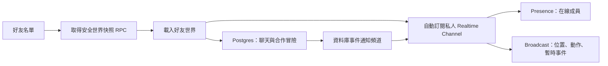

# 好友世界、多人同步與聊天實作計畫

本文件是 HabitHero 好友世界功能的執行規格。其他 AI 開始修改前，必須先讀取本文件、根目錄 `AGENTS.md`、`docs/code-maintainability.md`，若修改 CSS 再讀取 `CSS_RULES.md`。本計畫採用 Supabase Realtime 的 Presence、Broadcast 與私人頻道授權，並參考 BlockRift 的即時人物、好友列表與世界聊天互動。

## 1. 目標與完成條件

此功能讓小孩自行加入好友、直接參觀好友世界、在同一個好友世界看到其他在線好友、進行一般合作冒險，並使用遊戲式文字聊天。

完成後必須符合以下結果：

- 小孩輸入好友代碼並送出邀請，不需要家長預先開啟好友功能
- 對方小孩同意後，雙方成為好友
- 已成為好友後，點擊「參觀」就直接進入，不建立或選擇房間
- 好友離線時仍可參觀其最後保存的世界
- 多位在線好友進入同一個世界時，可以看到彼此的人物、移動、動作與聊天
- App 完整關閉或重新啟動後，人物回到自己世界的固定出生點
- 人物位置只存在記憶體與 Realtime 訊息，不寫入資料庫
- 只有一般冒險能成為合作冒險，每位參與者保留自己的完成與審核紀錄
- 訊息送出後顯示在人物頭上，聊天列保留最新訊息，點擊後展開完整對話
- 好友、Realtime、聊天、合作冒險與 UI 分屬不同模組，不集中到大型檔案

## 2. 已確定的產品規則

下列規則已由產品決策確定。實作 AI 不得自行改回家長預先批准、拜訪邀請或持久房間模式。

### 2.1 好友規則

- 使用好友代碼加入，不提供全域兒童姓名搜尋
- 好友邀請由小孩送出，也由對方小孩接受或拒絕
- 好友關係必須雙向成立，不能以單向追蹤替代
- 同一組小孩只能有一筆有效好友關係
- 自己不能邀請自己
- 被封鎖的雙方不能邀請、拜訪、收發訊息或共同冒險
- 家長不需要逐次批准好友或拜訪
- 家長安全工具與好友流程分離。家長可以查看自己孩子的好友、封鎖或檢舉紀錄，但不成為正常流程的必要步驟

### 2.2 直接進入世界

- 好友名單中的「參觀」是唯一入口
- 點擊後立即切換到該好友世界，不顯示「建立房間」、「房間代碼」或「等待主人同意」
- 世界主人在線與否，不影響好友進入資格
- 世界主人離線時，訪客讀取資料庫中最後保存的世界實體與設定
- 世界主人在線時，訪客讀取相同持久世界資料，再訂閱即時人物與事件
- 多個好友可以同時進入同一位好友的世界
- 世界主人不在線時，其他在線訪客仍可以看到彼此
- 訪客只可移動自己的角色、聊天、做表情與參與合作冒險
- 訪客不能修改世界主人的家具、寵物、商店、庫存、每日冒險、點數或獎勵

### 2.3 不建立持久房間

產品與資料庫都不建立 `world_rooms` 或 `room_members`。底層仍需要 Supabase Realtime Channel，因為 Presence 與 Broadcast 必須透過頻道傳送。

頻道不是產品房間。它由程式在進入世界時自動訂閱，最後一位使用者離開後由 Supabase 自動釋放。使用固定 topic：

```text
friend-world:<world_owner_child_profile_id>
```

所有進入同一位好友世界的人會訂閱相同 topic，因此不需要建立、查詢或清除房間資料列。

### 2.4 位置與重新啟動

- 本機角色位置只保存在 Three.js runtime 記憶體
- 遠端角色位置只保存在接收端記憶體
- 不新增 `last_position_x`、`last_position_z`、`last_rotation` 或相似欄位
- 不在移動、背景化、斷線或關閉 App 時寫入位置
- App 完整關閉或頁面重新載入後，先進入自己的世界，使用目前固定出生點
- 從好友世界返回自己的世界時，也使用自己的固定出生點
- 同一頁面發生短暫網路重連時，可保留本機記憶體中的位置並重新廣播
- 完整 reload、程序終止或 iOS 回收 WebView 後，不恢復好友世界或先前位置

目前固定出生點由 `src/features/world/prototype-world-runtime.ts` 設定。實作不得為此功能加入位置持久化。

### 2.5 合作一般冒險

- 每日冒險維持私人，不能分享或合作完成
- 只有一般冒險可以建立合作關聯
- 建立者在好友世界新增一般冒險時，當下在線的訪客收到即時通知
- 訪客必須主動按「一起冒險」才成為參與者
- 不能由一位小孩替另一位小孩完成任務
- 每位參與者建立自己的任務或完成紀錄，仍屬於自己的家庭
- 任何點數與家長審核沿用原有任務流程
- 好友端不能核准、拒絕或調整另一個家庭的點數
- 完成紀錄顯示同一合作關聯中的參與者，例如「你和小明、小美一起完成」
- Realtime 通知遺失時，重新載入必須從資料庫取得正確合作狀態

### 2.6 世界聊天

- 聊天範圍是目前好友世界，不是全域聊天
- 在線訊息出現在角色頭上，也出現在底部聊天列
- 點擊聊天列展開完整世界對話
- 好友世界主人離線時，訪客仍可留言
- 離線角色不顯示頭頂泡泡，訊息只進入聊天歷史
- 世界主人下次上線或進入自己的世界時可以讀取未讀訊息
- 第一版只支援純文字，不支援網址預覽、圖片、影片、附件或語音
- React 以文字節點渲染訊息，禁止使用 `dangerouslySetInnerHTML`
- 聊天作者、建立時間與訊息狀態必須由伺服器資料確認，不能信任 Broadcast payload

## 3. 技術架構

直接進入世界仍分成持久資料與暫時資料。持久資料使用 Postgres，暫時資料使用 Supabase Realtime。



### 3.1 持久資料

Postgres 保存下列資料：

- 好友代碼、邀請、好友關係、封鎖與檢舉
- 好友世界可公開的安全投影
- 世界聊天歷史與未讀狀態
- 合作一般冒險、參與者與完成關聯

Postgres 不保存下列資料：

- 玩家即時位置與旋轉
- 移動按鍵狀態
- 遠端角色 interpolation buffer
- 頭頂聊天泡泡顯示狀態
- Realtime Channel 或在線成員列表

### 3.2 世界快照

不要複製一份新的好友世界。新增 `get_friend_world_snapshot(target_child_profile_id uuid)` 安全 RPC，從既有世界資料回傳訪客需要的欄位。

RPC 必須：

- 從 `auth.uid()` 找到目前登入的小孩，不接受 client 傳入 requester ID
- 確認 requester 與 target 是有效好友且未封鎖
- 允許 target 本人取得自己的快照
- 只回傳公開人物外觀、已啟用世界實體、必要 catalog key、世界 revision 與安全顯示名稱
- 不回傳家庭 ID、家長資料、點數、庫存數量、購買紀錄、每日冒險或私人設定
- 使用固定 `search_path`、明確欄位與最小 grant
- 對訪客維持唯讀

世界資產已包在 App 中。RPC 只回傳 asset key 與 transform，不傳送 GLB、FBX 或縮圖 binary。

### 3.3 Realtime Channel 授權

Channel 必須設定 `private: true`。在 `realtime.messages` 建立 Broadcast 與 Presence 的 `select`、`insert` Row Level Security (RLS) policy。

Policy 必須：

- 從 `realtime.topic()` 解析世界主人 child profile ID
- 允許世界主人本人
- 允許已接受且未封鎖的好友
- 拒絕 pending、declined、removed 與 blocked 關係
- 同時限制 `broadcast` 與 `presence` extension
- 不建立公開 channel fallback

Supabase Realtime 不保證每個 Broadcast 都送達，因此位置與泡泡可以短暫遺失，但好友關係、訊息歷史與合作結果必須落在 Postgres。

### 3.4 Realtime 事件

所有事件必須有版本、遞增序號與最小 payload。第一版只允許以下事件：

| Event | 來源 | 持久化 | 用途 |
| --- | --- | --- | --- |
| `avatar_state_v1` | client Broadcast | 否 | 位置、朝向、移動與動作 |
| `avatar_emote_v1` | client Broadcast | 否 | 揮手、坐下、跳舞 |
| `world_revision_v1` | owner client Broadcast | revision 已存在 | 通知訪客重新抓取世界快照 |
| `chat_created_v1` | database event | 是 | 顯示可信聊天泡泡與最新訊息 |
| `coop_changed_v1` | database event | 是 | 更新合作冒險與完成狀態 |

`avatar_state_v1` 與 `avatar_emote_v1` 只影響畫面，視為不可信提示。它們不能建立訊息、完成任務、增加點數、修改世界或授權其他操作。所有持久操作都必須透過 RPC，並從 `auth.uid()` 推導操作者。

### 3.5 移動流量控制

保持位置不持久化仍會產生 Realtime 流量，因此必須限制廣播頻率。

- 自己獨處時不發送 `avatar_state_v1`
- Presence 顯示至少還有一位其他在線成員後才開始發送
- 移動中的最高發送頻率為每秒 8 次
- 位置變化小於 0.08 world unit 且旋轉變化小於 3 度時不發送
- 停止移動時發送一次最終狀態
- 靜止時最多每 2s 發送一次 keepalive，沒有其他成員時停用
- App 進入背景時立即停止移動廣播並 untrack Presence
- `avatar_state_v1` payload 目標小於 512 B
- 接收端使用 interpolation，不把網路頻率提高到 render frame rate
- 舊序號、錯誤版本、非有限數值與超出世界邊界的座標直接丟棄

建議 payload 欄位：

```text
v, connectionId, childProfileId, seq, x, z, rotationY, motion, emote, sentAt
```

不要傳送完整角色、寵物、家庭或世界物件。外觀由安全世界快照與好友公開資料解析。

## 4. 資料庫變更拆分

每個責任使用獨立 migration。禁止建立單一大型 social migration，也禁止修改已套用 migration history。

### 4.1 好友 migration

建立：

- `child_friend_codes`
- `child_friend_requests`
- `child_friendships`
- `child_friend_blocks`

加入：

- 邀請、接受、拒絕、移除與封鎖 RPC
- 唯一索引，將 friendship 兩端正規化為固定順序
- accepted friend lookup 索引
- child owner 與 family parent 的最小 RLS

好友代碼使用不可猜測的隨機值。資料庫儲存正規化值，UI 可以分段顯示。錯誤訊息不能透露某個代碼屬於哪位非好友小孩。

### 4.2 好友世界存取 migration

新增：

- `private.can_visit_friend_world(requester_user_id, world_owner_child_profile_id)`
- `get_friend_world_snapshot(target_child_profile_id)`
- `realtime.messages` 的 private Broadcast 與 Presence policy

不得新增：

- `world_rooms`
- `room_members`
- `last_player_positions`
- `world_presence`

### 4.3 聊天 migration

建立：

- `friend_world_messages`
- `friend_world_message_reads`
- `friend_world_message_reports`

建立 `send_friend_world_message` RPC。RPC 負責身份、好友、封鎖、長度、頻率與內容檢查，再寫入 canonical sender。

### 4.4 合作冒險 migration

建立：

- `coop_adventures`
- `coop_adventure_participants`
- `coop_adventure_completions`

合作資料只保存跨家庭關聯。個人任務、家長審核與點數仍使用現有 `tasks` 與 point ledger，不把跨家庭資料塞進原表的 RLS。

## 5. 程式模組與檔案 owner

每個 domain 擁有自己的 contract、limits、repository、service、hooks、UI 與 tests。禁止新增 `social.ts`、`friend-system.ts` 或把所有 Realtime 行為放進現有 `src/lib/realtime.ts`。

建議結構：

```text
src/features/friends/
  contracts.ts
  limits.ts
  friend-code.ts
  friend-service.ts
  hooks/use-friends.ts
  components/FriendDock.tsx
  components/FriendListSheet.tsx
  components/FriendRequestSheet.tsx

src/features/world-multiplayer/
  contracts.ts
  limits.ts
  world-topic.ts
  world-presence.ts
  world-broadcast.ts
  remote-avatar-state.ts
  remote-avatar-controller.ts
  components/RemoteAvatarLayer.tsx
  hooks/use-world-multiplayer.ts

src/features/world-chat/
  contracts.ts
  limits.ts
  chat-service.ts
  chat-bubble-queue.ts
  hooks/use-world-chat.ts
  components/WorldChatDock.tsx
  components/WorldChatSheet.tsx
  components/AvatarChatBubble.tsx

src/features/co-op-adventures/
  contracts.ts
  limits.ts
  coop-adventure-service.ts
  coop-adventure-state.ts
  hooks/use-coop-adventures.ts
  components/CoopAdventureCard.tsx
  components/CoopCompletionSummary.tsx

src/lib/social-data/
  friendship-repository.ts
  friend-world-repository.ts
  world-chat-repository.ts
  coop-adventure-repository.ts
```

實際檔名可以依現有慣例調整，但責任邊界不可合併。`src/lib/social-data` 不得 import React 或 `src/components`。

### 5.1 既有大型檔案限制

- `src/components/ChildDashboard.tsx` 不得淨增加行數。以一個 feature entry component 取代局部組裝
- `src/store.tsx` 不得成為好友、Presence、聊天或多人位置 owner
- `src/lib/realtime.ts` 保留現有 app data subscription。好友世界使用新的 feature transport
- `src/features/world/prototype-world-runtime.ts` 不得淨增加行數。只暴露最小 adapter，新增行數必須由同責任 extraction 抵銷
- `src/features/world/TerrainWorldLayer.tsx` 不得持有聊天 repository 或 Supabase Channel lifecycle
- 不修改寵物 runtime、GLB、FBX、catalog、migration 或 golden baseline

### 5.2 原始碼容量限制

所有 AI 必須遵守 `docs/code-maintainability.md`：

| 類型 | 目標 | 警示線 | 硬上限 |
| --- | ---: | ---: | ---: |
| React component 或 hook | 250 行 | 300 行 | 400 行 |
| domain service、utility、repository | 250 行 | 300 行 | 400 行 |
| runtime coordinator | 400 行 | 500 行 | 600 行 |
| 單一函式 | 50 行 | 80 行需說明 | 不得無說明超過 80 行 |
| CSS owner | 依 selector owner | 800 行 | 不可用 override 堆疊規避 |

每個 domain 的 `limits.ts` 只保存該 domain 的容量與節流設定，不建立全域 `social-limits.ts`。測試必須鎖定這些限制。

## 6. 產品容量限制

第一版採用可測試的 App 級限制。未經產品決策，不得在 UI 隱藏或自行放寬。

| 項目 | 第一版限制 |
| --- | ---: |
| 每位小孩有效好友 | 50 |
| 尚未處理的送出邀請 | 20 |
| 尚未處理的收到邀請 | 20 |
| 同一好友世界在線人物 | 8，包含世界主人 |
| 世界快照 active entities | 最多 250，分頁每次 100 |
| 移動廣播 | 最高 8 次／秒／在線人物 |
| 移動 payload | 目標小於 512 B |
| 一般 Realtime event payload | 上限 2 KB |
| 單則聊天 | 1 至 120 個 Unicode 字元 |
| 聊天發送 | 10s 內最多 5 則，1 分鐘最多 30 則 |
| 聊天初始載入 | 最新 50 則 |
| 聊天分頁 | 每頁 50 則，前端記憶體最多 200 則 |
| 頭頂泡泡 | 最多 2 行，顯示 4s |
| 每個世界同時 active 合作冒險 | 5 |
| 單一合作冒險參與者 | 8 |

不為容量限制建立房間或在線成員資料表。client 訂閱後等待第一次 Presence sync，依 `joinedAt` 與 `connectionId` 排序所有連線；排序在前 8 名的連線留下，其餘連線立即 untrack、unsubscribe，並顯示「這個世界目前有點擁擠，稍後再試」。所有 client 必須使用同一個 pure function 計算結果，並以單元測試鎖定排序與同時加入競態。這是正常 App client 的效能限制，不是資料授權邊界；RLS 與 RPC 仍負責真正的安全限制。

聊天資料預設保留 30 天。檢舉中的訊息在案件結束前不能由清理程序刪除。實作排程清理前，必須確認 Supabase 專案可用的排程方式與資料保留需求。

## 7. UI 與互動規格

UI 延續現有 HabitHero 世界風格，不建立獨立社群首頁。

### 7.1 好友入口

- 世界畫面提供可辨識的好友圖示與文字標籤
- 點擊區至少 44 × 44 px
- 好友名單顯示在線狀態、目前所在世界與「參觀」按鈕
- 離線好友標示「離線世界」與最後世界更新時間
- 好友邀請輸入框有固定 label，不只使用 placeholder
- 送出、接受、拒絕、封鎖與錯誤都有即時回饋

### 7.2 遠端人物

- 遠端人物使用本機已打包角色資產，不下載外部模型
- 名稱標籤與聊天泡泡使用 DOM overlay 或現有標籤系統，不把可變文字烘焙進 3D texture
- 遠端人物移動使用 interpolation，斷線後淡出並 dispose 資源
- 畫面只同時渲染容量內的人物
- 支援 `prefers-reduced-motion`，減少泡泡與進出場動畫

### 7.3 聊天介面

- 收合狀態顯示最新一則訊息與未讀數
- 展開狀態使用 bottom sheet，保留關閉、返回與鍵盤安全區
- 送出後等待 canonical database row，再顯示可信作者與時間
- 頭頂泡泡只顯示最新訊息，完整內容保留在 sheet
- 訊息、送出按鈕、關閉按鈕與檢舉按鈕要有可讀 label 與 accessibility name
- 文字與背景對比至少 4.5:1

修改任何 CSS 前，先讀 `CSS_RULES.md`，找到 selector owner。禁止在大型 CSS 檔尾端追加覆蓋式修正。

## 8. 安全與兒童資料邊界

好友功能不需要家長預先開啟，但所有跨家庭操作都必須通過伺服器授權。

- 所有 mutation 使用 RPC 或受控 repository，不接受 client 指定操作者
- 所有 social table 啟用 RLS
- 所有 SECURITY DEFINER function 固定 `search_path` 並撤銷 public execute
- 好友世界只暴露最小公開投影
- 聊天只接受純文字，trim 後驗證長度與控制字元
- 禁止網址、電子郵件、電話格式與 HTML 第一版直接送出
- 封鎖立即中止新訊息、新拜訪與 Realtime topic 授權
- 檢舉保存 message ID、reporter、reason、created_at，不複製不必要的兒童資料
- rate limit 同時按 authenticated child 與 world owner 計算
- client Broadcast 的 sender ID 不得用於持久權限判斷
- log 不記錄完整聊天內容、好友代碼、JWT、家庭名稱或兒童私人資料
- 錯誤訊息不透露非好友是否存在、是否在線或屬於哪個家庭

## 9. 分階段實作順序

每個階段使用獨立 commit。不要在同一 commit 混合 migration、3D runtime、聊天 UI 與 CSS 重整。

### Phase 0：契約與基線

1. 記錄 branch、HEAD 與 dirty worktree
2. 為既有固定出生點、世界載入與 Realtime recovery 補 characterization tests
3. 建立各 domain contracts 與 limits tests
4. 確認 `npm run quality:structure` 不允許大型檔案回長

### Phase 1：好友資料與 RPC

1. 新增好友 migration
2. 實作好友 repository 與 service
3. 實作邀請、接受、拒絕、移除與封鎖
4. 加入 SQL contract、RLS 與競態測試
5. 不修改 3D world

### Phase 2：好友 UI 與離線參觀

1. 加入 FriendDock 與好友 sheet
2. 實作 `get_friend_world_snapshot`
3. 加入世界 owner context 與返回自己世界流程
4. 訪客模式鎖定家具、寵物、商店與世界 mutation
5. App reload 驗證回到自己的固定出生點

### Phase 3：直接 Realtime 多人同步

1. 建立 deterministic private topic
2. 加入 Realtime RLS policy
3. 實作 Presence 訂閱與 8 人容量限制
4. 實作 remote avatar controller、interpolation 與 dispose
5. 只在有其他成員時廣播位置
6. 驗證不產生位置資料庫寫入

### Phase 4：世界聊天

1. 新增聊天 migration、RPC 與資料庫事件
2. 實作聊天 dock、sheet 與頭頂泡泡
3. 加入 rate limit、封鎖、檢舉、未讀與分頁
4. 驗證 Broadcast 遺失後可由資料庫恢復歷史
5. 驗證離線世界留言與主人下次上線讀取

### Phase 5：合作一般冒險

1. 新增合作 migration 與 RPC
2. 只允許一般冒險加入合作關聯
3. 在線訪客收到新增通知並主動加入
4. 每位參與者保存自己的 task completion
5. 完成頁顯示共同參與者，不跨家庭核准點數

### Phase 6：完整驗證

1. 執行 domain tests
2. 執行完整自動化驗證
3. 在兩個以上獨立 child account 驗證跨家庭好友
4. 在三個 client 同時進入同一離線 owner 世界
5. 驗證第 9 位遭容量限制
6. 驗證 iOS 背景化、恢復、完整關閉與重新啟動
7. 記錄未執行的 browser、device 與 3D visual evidence

## 10. 必要測試

至少新增以下測試 owner，實際檔名可依現有慣例調整：

- `tests/friendship-database-contract.test.ts`
- `tests/friendship-rls.test.ts`
- `tests/friend-code-validation.test.ts`
- `tests/friend-world-snapshot.test.ts`
- `tests/friend-world-visit-permissions.test.ts`
- `tests/world-multiplayer-protocol.test.ts`
- `tests/world-multiplayer-throttle.test.ts`
- `tests/world-multiplayer-capacity.test.ts`
- `tests/remote-avatar-state.test.ts`
- `tests/world-chat-contract.test.ts`
- `tests/world-chat-rate-limit.test.ts`
- `tests/world-chat-ui.test.ts`
- `tests/coop-adventure-contract.test.ts`
- `tests/coop-adventure-points-isolation.test.ts`
- `tests/friend-world-reload-spawn.test.ts`

測試必須覆蓋：

- 非好友無法取得世界快照或加入 private topic
- 好友移除或封鎖後，重新連線立即失去資格
- pending 邀請不能拜訪
- owner 離線時多個訪客可互相看見
- 沒有其他成員時完全不發送位置
- 位置沒有 insert 或 update 到任何 public table
- reload 後固定出生，不恢復好友世界
- client 偽造 sender ID 不能建立聊天、完成任務或取得點數
- 每日冒險不能轉為合作
- Broadcast 遺失不會遺失聊天或合作完成結果
- 訪客不能修改 owner 的世界實體

## 11. 驗證指令與停止閘門

每個 phase 結束至少執行相關 tests、lint、structure 與 diff check。功能完成後執行：

```bash
npm run lint
npm run quality:structure
npm test
npm run build
npm run security:check
git diff --check
```

停止條件：

- 既有測試基線失敗
- 新檔超過硬上限或既有大型檔案回長
- migration 放寬現有家庭資料 RLS
- 訪客可讀取私人任務、點數、庫存或家長資料
- 人物移動造成 Postgres 寫入
- private channel 可由非好友加入
- 聊天可繞過 canonical sender、長度或 rate limit
- 合作任務可由好友替他人取得點數
- 未讀 `CSS_RULES.md` 就開始修改 selector
- 寵物呈現、資產或 runtime 被意外改動

遇到停止條件時，只回報 evidence 與受影響範圍，不用降低安全檢查或放寬容量讓測試通過。

## 12. 完成驗收

功能只有在以下條件全部成立時才算完成：

- 好友邀請與接受流程不需要家長開關
- 好友點擊後直接進入，產品與資料庫沒有持久房間
- 在線與離線 owner 世界都可參觀
- 最少三位在線訪客能在同一世界看到彼此
- 位置只存在記憶體與 Realtime
- 完整重啟回到自己世界固定出生點
- 聊天泡泡、收合列與完整對話一致
- 訊息與合作結果在 Realtime 遺失後仍可恢復
- 一般合作冒險維持每位小孩的家庭與點數隔離
- 所有跨家庭讀寫通過 RLS 或安全 RPC
- 模組與 rules 分散在各 domain，沒有新增集中式巨型檔案
- 所有自動化指令通過，browser、device、3D visual evidence 有明確紀錄

## 13. 外部參考與採用邊界

- [Supabase Realtime](https://github.com/supabase/realtime)：採用 Presence、Broadcast、Postgres Changes 與「Broadcast 不保證送達」的資料分層原則
- [Supabase Realtime Authorization](https://github.com/supabase/supabase/blob/master/apps/docs/content/guides/realtime/authorization.mdx)：採用 private channel 與 `realtime.messages` RLS
- [BlockRift](https://github.com/kfrp/blockrift)：參考同一世界在線人物、好友列表、世界聊天與區域廣播概念

BlockRift 會保存離線位置，HabitHero 明確不採用此行為。HabitHero 也不複製 BlockRift 的 Redis、HTTP POST 或建造權限架構。第一版維持現有 React、Three.js、Supabase 與 Capacitor 技術棧，不新增 Nakama、Colyseus、Socket.IO、Redis 或獨立遊戲伺服器。

## 14. AI 執行回報格式

每個 AI 完成一個 phase 後，使用以下格式回報：

```md
## Scope
- Phase:
- Product rules implemented:
- Explicitly out of scope:

## Files
- New domain owners:
- Existing integration files:
- Migrations:
- Tests:

## Capacity
- Largest new TS/TSX file:
- Existing hotspot before/after lines:
- Realtime limits verified:

## Security
- RLS/RPC evidence:
- Cross-family data exposed:
- Spoofing/rate-limit tests:

## Verification
- Commands and exit codes:
- Browser/device evidence:
- Missing evidence:

## Result
- Pass, stopped, or reverted:
- Remaining risk:
- Next phase:
```
