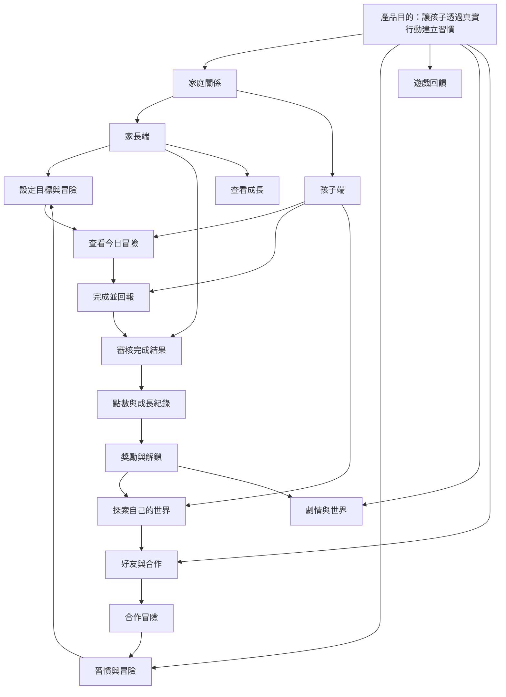
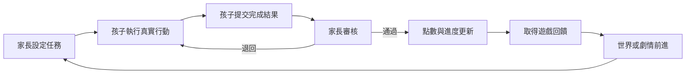
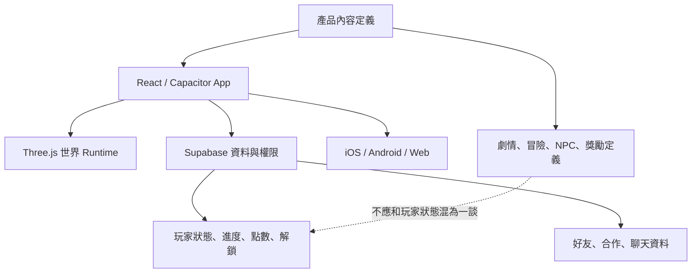

# HabitHero 產品架構圖

> 狀態：`[草稿]`。這是產品能力圖，不是目前 TypeScript 檔案的 import graph。

## 產品能力關係

## 核心循環

## 產品與技術邊界

## 每次新增功能前要回答

- 它服務家長、孩子，還是好友？
- 它是否強化核心循環？
- 它是內容、規則、玩家狀態，還是畫面呈現？
- 它需要永久保存，還是可以由內容檔重新產生？
- 它是否會影響點數、VIP、隱私或孩子安全？
- 沒有這個功能，核心產品是否仍然成立？
