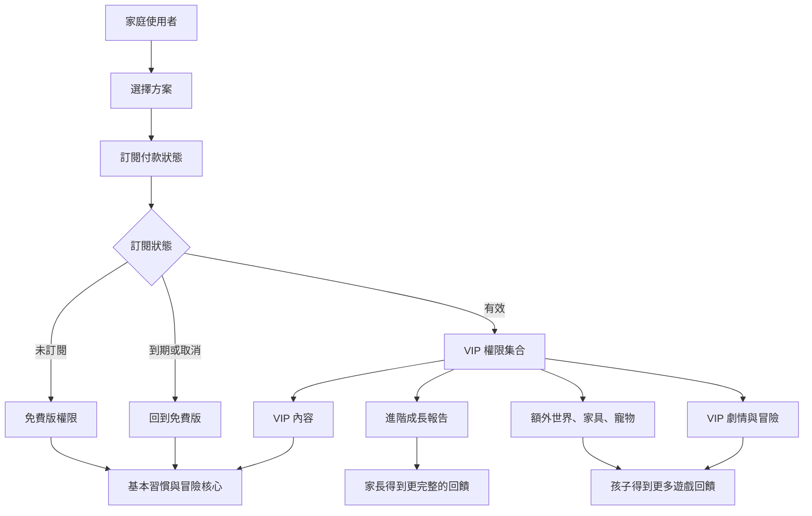

# HabitHero VIP 系統圖

> 狀態：`[待討論]`。這份文件先整理關係，不代表價格、上限或 VIP 內容已經決定。

## VIP 的產品關係

## 訂閱不應改變的核心原則

- `[待討論]` 免費版仍然能完成基本習慣任務。
- `[待討論]` 免費版仍然能使用基本點數與獎勵流程。
- `[待討論]` VIP 到期後，孩子已完成的紀錄不消失。
- `[待討論]` VIP 到期後，已取得的物品如何處理要明確定義。
- `[待討論]` 家長看到完整付款與權限資訊，孩子看到適合年齡的內容。
- `[待討論]` 不用付費才能避免負面懲罰或維持基本進度。

## 方案矩陣

精確數字放在這裡，不只放在圖表裡。`[待討論]` 必須在商業決策後才替換。

| 功能 | 免費版 | VIP 月訂閱 | VIP 年訂閱 | 到期後行為 |
| --- | --- | --- | --- | --- |
| 基本孩子帳號 | [決定] | [決定] | [決定] | 保留 |
| 基本冒險任務 | [待討論] | [待討論] | [待討論] | 保留基本功能 |
| 每日冒險上限 | [待討論] | [待討論] | [待討論] | 回到免費上限 |
| 基本點數與獎勵 | [待討論] | [待討論] | [待討論] | 保留歷史紀錄 |
| VIP 冒險模板 | [待討論] | [待討論] | [待討論] | 新內容不可用 |
| VIP 劇情章節 | [待討論] | [待討論] | [待討論] | 進度保留，內容權限待定 |
| VIP 寵物與家具 | [待討論] | [待討論] | [待討論] | 已取得物品待定 |
| 成長報告 | [待討論] | [待討論] | [待討論] | 回到基本報告 |
| 月費 | — | [待討論] | — | — |
| 年費 | — | — | [待討論] | — |

## VIP 決策順序

## 需要特別討論的問題

- VIP 是為了增加孩子內容，還是減少家長建立任務的時間？
- VIP 是否包含更多家庭成員或多個孩子？
- VIP 內容是一次購買、月訂閱，還是季節通行證？
- 家長取消訂閱後，已解鎖劇情和已購買物品如何處理？
- 哪些功能不應該收費，否則會傷害習慣養成的核心價值？
- 是否需要試用期、退款後狀態和跨平台恢復購買？
