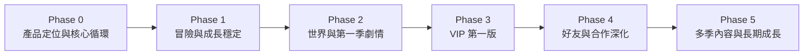

# HabitHero 未來規劃圖

> 狀態：`[草稿]`。這裡用階段描述能力，不先承諾日期。

## 發展順序

## Phase 0：先確認做什麼

- [待討論] 一句話產品定位
- [待討論] 目標年齡與家庭情境
- [待討論] 主要要改善的習慣問題
- [待討論] 核心循環是否成立
- [決定] 先用圖與文件確認方向，再進入大功能開發

## Phase 1：穩定核心循環

- [決定] 家長建立任務
- [決定] 孩子完成與回報
- [決定] 家長審核
- [決定] 點數與獎勵
- [待討論] 成長統計是否足以讓家長理解變化
- [待討論] 離線與同步體驗

## Phase 2：世界與第一季劇情

- [待討論] 第一季世界主題
- [待討論] NPC 與主線問題
- [待討論] General Adventure 與章節關係
- [待討論] 任務完成如何改變世界
- [待討論] 第一批可解鎖寵物、家具與裝飾

## Phase 3：VIP 第一版

- [待討論] VIP 目標客群
- [待討論] 免費版底線
- [待討論] VIP 內容清單
- [待討論] 月費、年費與試用
- [待討論] 付款、取消、到期與恢復購買
- [待討論] 第一版只驗證一個清楚的付費價值

## Phase 4：好友與合作

- [決定] 好友功能不能破壞孩子安全
- [待討論] 合作冒險的必要性
- [待討論] 好友世界的互動深度
- [待討論] 聊天、邀請與家長控制
- [想法] 限時合作事件

## Phase 5：長期內容

- [想法] 第二季、第三季世界
- [想法] 季節活動
- [想法] 收集與圖鑑
- [想法] 多語系
- [想法] 家庭長期成長報告

## 每一階段的進入條件

- 前一階段的核心問題已經有答案。
- 需求、流程和資料責任已經在圖上表示。
- 不會依賴尚未決定的 VIP、劇情或社交規則。
- 有可驗證的使用者結果，而不只是新增畫面或資料表。
